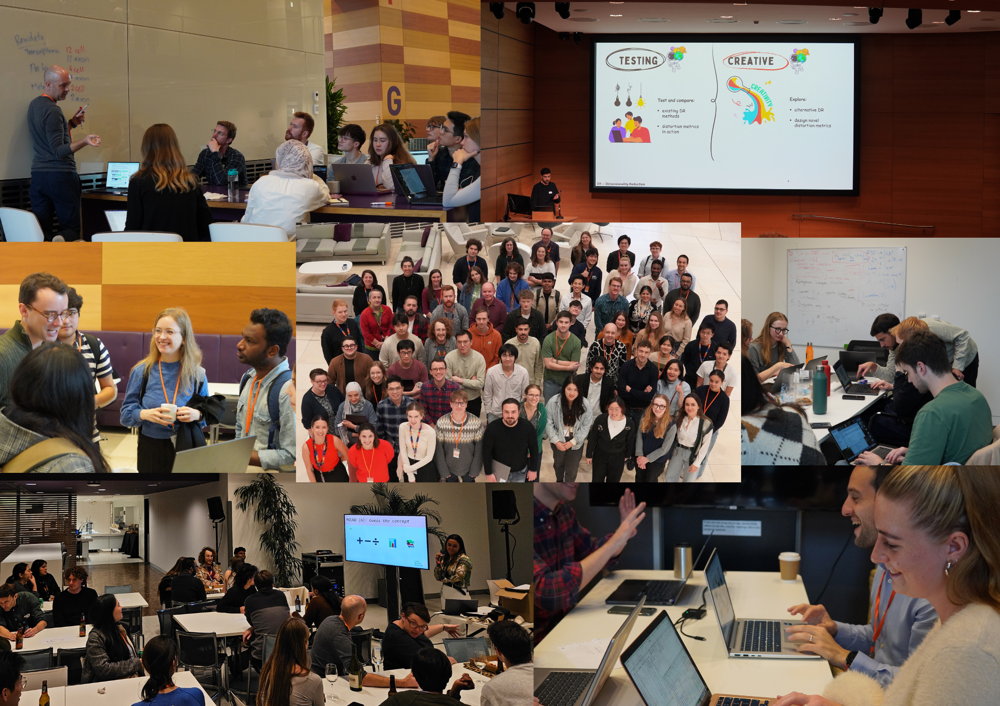

# Crick Data Challenge #9
## 6th & 11th - 13th November 2026 at the [Francis Crick Institute](https://share.google/vpChH6q9vZth9YaEs), London

_Are you ready to take on a challenging data problem and apply your computational skills? Want to work as part of a team to explore new ways of analysing data? Want to connect with computational scientists with diverse backgounds and expertise who share a passion for solving problems and coding challenges?_ 🚀

Join our **inter-institutional** 4-day hackathon-style event and tackle one of the projects proposed by Crick scientists!

> **This year's event is funded by the UKRI-funded network [DisCouRSE](https://discourse-network.github.io/projects/1-49-crick-data-challenge/).**

---
### Quick navigation 
- 🧪[A sneak peak into this year's projects](#-a-sneak-peak-into-this-years-projects)
- 📝 [Participant sign-ups are now OPEN](#-participant-sign-ups-are-now-open)
- ⚙️ [How does it work?](%EF%B8%8F-how-does-it-work)
- 💭 [Thoughts on past CDC attendees](#what-previous-participants-loved-most-about-the-data-challenge)
- 👥 [Thoughts from previous project leads](#-thoughts-from-previous-project-leads)
- 🔬 [Examples of previous projects](#examples-of-previous-projects-include)
- 🧾 [Crick Data Challenge projects that contributed to scientific papers](#-crick-data-challenge-projects-have-contributed-to-scientific-papers)
- ❓ [Contact details](#-questions-get-in-touch)

---

## 🧪 A sneak peak into this year's projects
We have an exciting line-up of projects in the making! 👩‍🍳 The projects for this year's event will be revealed during the _project pitch_ on the morning of the first day.
We won't spoil the surprises, but get ready for challenges that will test your creativity and coding skills in new ways. You might find yourself taming big imaging datasets, wrangling datasets to better understand psychosis, exploring the spatial  dimension, or deep-diving into the 'usefulness' of agentic analyses in a biomedical context. 
Whatever the challenge, this year's line-up offers a unique chance to collaborate, learn, and push the boundaries of data-driven biomedical research.

## 📝 Participant sign-ups are now OPEN
As a participant, you will join one of the various projects submitted by Crick scientists. You will work in a team with 5-10 other participants to find a potential solution to the challenge presented.

Applications are open for academic institutions in the London area. Apply now via [this form](https://forms.cloud.microsoft/e/K5m5V6XCpP) before the **12th October, 12:00**.

[Get in touch](mailto:data-challenge@crick.ac.uk) if you would like to ask any questions about the event. 

---

## ⚙️ How does it work?

1. Crick scientists submit their projects to the Data Challenge. 
2. The organising committee selects up to 6 projects. 
3. Data scientists (internal and external) sign up to the event. They're given a clue about the theme of each project, but no spoilers. 
4. **Launch Day** (*Friday, 6th November*) – project leads pitch their ideas to build a team of data scientists who will work on the project during the Hacking Days. Leads, mentors, and hackers will have the chance to connect over lunch and participate in dedicated workshops in preparation for the event. We’ll end the day with the **Crick Pub Quiz Challenge** to break the ice and build the much-needed collaborative atmosphere!
5. **Hack Days** (*Wed, 11th - Fri, 13th November*) – here’s where the magic happens! Teams work on their dedicated project for 3 uninterrupted days. On the last day, all teams will present their progress, and we will host a closing reception to celebrate new collaborations!

The [video](https://www.youtube.com/watch?v=VzwoGWMCY-U) below will give you a glimpse of what the Crick Data Challenge is about!

---

## What previous participants loved most about the Data Challenge:

#### 🤝 Teamwork, collaboration, & networking
> "I appreciated the social aspect of the event. It created valuable opportunities to meet and connect with people from different backgrounds, which made the whole experience even more enriching."

> "Getting to connect with enthusiastiuc data scientists. Everyone wanted to throw themselves into the challenge and most participants wanted to continue collaboration after the event."

#### 💡 Building new skills
> "Building new skills and meeting others at the Crick! It's a big organization and the CDC made it feel smaller."

> "Opportunity for students to try a collaborative environment to solve a common challenge."

#### 📚 Project variety 
> "I really enjoyed the structure [...]. The way the event was organised made it easy to follow, and the range of available projects covered many different directions. This was especially great because it meant that even participants without a strong biology background could still find plenty of suitable options."

> "Variety of project topics and openness and friendliness of the participants and organisers."

---

## 🔬Examples of previous projects include:

* Integration of multiomic datasets to identify biomarkers for non-invasive, early detection of cancer. 
* Creation of a program with a user interface to design antisense oligonucleotides. 
* Integration of huge amounts of cancer RNA-Seq data to identify genes that could be therapeutic targets. 
* Design of a method to categorise and classify spherical cell images from a magnetic tweezer microscope system. 
* Investigation of Drosophila fruit preferences using chemical, behavioural and electrophysiological data sets. 
* Implementation of a streamlined pipeline for analysing highly complex, multi-dimensional imaging data.  

## 🧾 Crick Data Challenge projects have contributed to scientific papers:

* Van Maldegem, Febe, et al., (2021). Characterisation of tumour microenvironment remodelling following oncogene inhibition in preclinical studies with imaging mass cytometry. [Nature Communications](https://www.nature.com/articles/s41467-021-26214-x) (Crick Data Challenge #1) 
* Wilkinson, K. A., et al., (2021). Antiretroviral Treatment-Induced Decrease in Immune Activation Contributes to Reduced Susceptibility to Tuberculosis in HIV-1/Mtb Co-infected Persons. [Frontiers in Immunology](https://www.frontiersin.org/articles/10.3389/fimmu.2021.645446/full) (Crick Data Challenge #2)
* White, M.E., et al., (2023). Oxonium ion scanning mass spectrometry for large-scale plasma glycoproteomics. [Nature Biomedical Engineering](https://www.nature.com/articles/s41551-023-01067-5)  (Crick Data Challenge #3)

Many more projects have seeded ongoing collaborations and we expect to see more publications in the future!

<!-- <iframe width="560" height="315" src="https://www.youtube.com/embed/VzwoGWMCY-U" title="YouTube video player" frameborder="0" allow="accelerometer; autoplay; clipboard-write; encrypted-media; gyroscope; picture-in-picture; web-share" allowfullscreen></iframe> -->

---

## 👥 Thoughts from previous project leads

**_Lina Gerontogianni, Bioinformatics and Biostatistics STP_**
>"The CDC reminded me that research does not happen in a vacuum."

**_Eleonora Centanini, Devine lab_**
>"Collaborating within a highly multidisciplinary team was the main highlight [...] The different perspectives significantly enriched our discussions and led to several new analytical ideas.”

**_Laabiah Wasim, Tolar lab_**
>“As a wet-lab biologist, the Crick Data Challenge provided a unique opportunity to investigate an explorative question I had, but didn’t have the bioinformatics/machine-learning skills to answer. I got to work with such brilliant individuals and going back and forth with the idea as a team accelerated its development into a project we’re hoping to continue working on. It all depends on assembling the right team of individuals, which the Crick Data Challenge provided the perfect place for!”

**_Lucia Prieto-Godino, group leader_**
>“The Crick Data Challenge is a great initiative; as soon as I heard about it I decided to join and encouraged my students to do so. We are lucky to work in such a multidisciplinary environment at the Crick. Each discipline has classical ways to analyse data and we often do not go beyond these. However, by looking at our data from a different perspective we might gain novel biological insights.”

---

## ❓ Questions? Get in touch!

If you have any questions at all, please email [data-challenge@crick.ac.uk](mailto:data-challenge@crick.ac.uk) and we will get back to you.

All attendees at our events must adhere to our [code of conduct](code-of-conduct.md).

